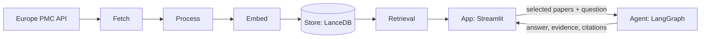

# CiteHer

Search women's health research and ask questions that are answered only from the papers you choose, with each claim linked to its source.

**[Open the live app](https://research-rag-agent-sk.streamlit.app/)**

---

## What it does

Research papers are hard to search by keyword, and AI summaries often make up citations. CiteHer takes a different approach:

1. You search by meaning sematically across a set of women's health papers.
2. You select 1 or 2 papers.
3. You ask a question. The answer is built only from those papers' abstracts, and every piece of evidence shows which paper it came from.

---

## System overview

The first four steps (fetch, process, embed, store) run offline as a scheduled job and produce a vector database. The app reads from that database. When a user selects papers and asks a question, the agent runs on those papers only.

---

## The layers

### 1. Fetch

Downloads paper records from the [Europe PMC](https://europepmc.org/) REST API.

- The default query is `(women OR female) AND (health OR medicine)`, limited to 60 papers by default.
- It pages through results using the API's cursor.
- Failed requests are retried up to 3 times, waiting 1, 2, then 4 seconds.
- It stops with an error if the cursor stops changing or if it goes past 20 pages, so it cannot loop forever.

The source can be slow or return errors. The fetch step fails clearly instead of passing bad data along.

### 2. Process

Turns raw API records into clean, consistent paper records.

- Removes HTML tags and extra whitespace from titles and abstracts.
- Gives each paper an ID: `source:id` if available, otherwise the DOI, otherwise a hash of the title.
- Skips duplicates and records with no title.
- Builds a link to the paper, preferring PMC, then PubMed, then the DOI.
- Builds the text to embed: `Title: ... Abstract: ...`.

Stable IDs are needed later to check that the agent only cites papers the user selected.

### 3. Embed

Converts each paper's text into a vector so papers can be searched by meaning.

- Uses the `BAAI/bge-large-en-v1.5` model through `sentence-transformers`. It produces 1024-number vectors.
- Vectors are normalized, so cosine similarity works correctly.
- Before saving, the code checks the vector size, the number of vectors, and that no value is NaN or infinite.
- The same model embeds the user's search query, so queries and papers are compared in the same space.

A vector of the wrong size or with invalid values would silently give bad search results. The checks make it fail early.

### 4. Store

Saves papers and vectors in [LanceDB](https://lancedb.com/), a database that lives in local files.

- The table has a fixed schema: id, title, abstract, url, publication date, source, DOI, PMID, PMCID, and a 1024-number vector. None of the fields can be empty.
- Updates are done safely: the new database is built in a temporary folder, its row count is checked, the current database is backed up, and only then is the new one moved into place.

A refresh that fails halfway must not break the live app.

### 5. Retrieval

Finds papers for a search and for the landing page.

- **Search:** the query is embedded and compared with stored vectors using cosine similarity. The top 10 results are shown, each with a similarity score.
- **Discovery (landing page):** runs 10 topic searches (for example Endometriosis, PCOS, Fertility, Menopause) and takes 5 results from each. Results are mixed in turns and duplicates removed, giving 10 varied papers instead of 10 similar ones.
- **Selection checks:** at most 2 papers, no duplicates, no empty IDs, and every ID must exist in the database.

Limiting the agent to a small, checked set of papers is what keeps its answers grounded.

### 6. Agent

Answers a question using only the selected papers.

A [LangGraph](https://www.langchain.com/langgraph) graph runs three steps in order:

1. **Extract evidence.** The model reads the abstracts and returns structured JSON: a paper ID, a claim, and the supporting text. The output must match a fixed schema. The code then discards any item whose paper ID is not one of the selected papers.
2. **Write analysis.** The model compares the evidence, notes which papers contributed, and notes limits visible in the abstracts.
3. **Write answer.** The model writes a focused answer from the analysis and the evidence.

- If any step fails, the graph stops and the app shows the error.
- The model is `openai/gpt-oss-20b` on Groq, with temperature 0, retries, a request rate limit, and a token limit.
- Token usage is added up across all three steps.

Splitting the work into steps means the evidence is fixed before any answer is written, and the paper ID check is done in code instead of trusting the prompt.

### 7. App

The Streamlit interface.

- A research tab with search, topic buttons, and paper cards showing title, date, source, PMID, DOI, abstract, and similarity score.
- Checkboxes to select up to 2 papers.
- An agent tab where you type a question and see the result.
- The result shows four parts: **Answer**, **Evidence** (claim plus text from the abstract), **Citations** (title, date, source, PMID, DOI, and a link), and **Token usage**.
- The embedding model, database connection, and agent graph are loaded once and reused.

The evidence and citations are shown next to the answer so the user can check it.

---

## How it avoids made-up answers

- The agent only sees the abstracts of the papers the user selected.
- Paper IDs returned by the model are checked in code against the selected set.
- Citation details (title, DOI, PMID, link) come from the database, not from the model.
- The prompts tell the model to say when the evidence is not enough, and not to claim it read the full paper.
- The app states that it works from abstracts only.

---

## Automatic data refresh

A GitHub Actions workflow (`.github/workflows/refresh_research.yml`) runs about every 2 days, and can also be started by hand. It:

1. Runs the ingestion script (fetch, process, embed, store).
2. Runs a database check.
3. Commits the updated `data/lancedb/` folder to the repository.

The live app reads the database from the repository, so no separate database server is needed.

---

## Tech stack

| Part | Tool | Used for |
|---|---|---|
| Data Source | Europe PMC REST API | Paper records |
| Embeddings | sentence-transformers, `bge-large-en-v1.5` | Turning text into semantic vectors |
| Vector Database | LanceDB, PyArrow | Vector storage and cosine search |
| Agent | LangGraph, LangChain | Three-step workflow with shared state |
| LLM | Groq, `openai/gpt-oss-20b` | Evidence, analysis, answer |
| Schema | Pydantic | Structured output from the model |
| UI | Streamlit | Web app |
| Automation | GitHub Actions | Scheduled refresh |

---

## Limitations

- **Abstracts only.** The agent does not read full papers, so it can miss details that are only in the full text.
- **Small collection.** The default is 60 papers, so some topics have few or weak matches.
- **Search by meaning only.** There is no keyword search alongside it.
- **Evidence text is not checked word for word.** The paper ID is verified, but the model's evidence text is not compared against the abstract in code, so it may be a paraphrase.
- **At most 2 papers per question.**

## Disclaimer

CiteHer is for exploring research. It is not medical advice and does not replace a doctor. Do not use it to make health decisions.